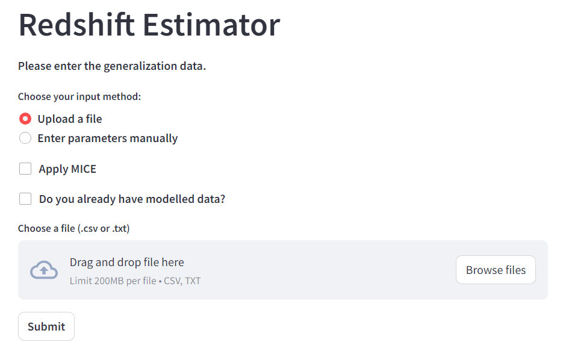

# Usage
On this page, we go over the most important user-facing functions that the Redshift-Estimator (X-ray) web app has and what each of these functions does. Read this page carefully to understand the various arguments/options that can be set while using these functions.


As discussed in [Getting Started](./Getting_Started.md), copy the files and run the app.py file in an IDE (preferably, VSCode) and write the following in the terminal: 
```streamlit run app.py```

Below is the illustration of our web app interface showing how it works.




```{Attention}
To start using the Redshift-Classifier and for first-hand testing, the user only needs to use the ``NEW-XRAY_DATA_RAW_w_errorbar_WITHOUT-M-estimator.csv`` data file from the [data](https://github.com/Milind018/Redshift-Classifier/tree/main/data) folder. However, we have already provided all the datasets in the [data](https://github.com/Milind018/Redshift-Classifier/tree/main/data) folder that we have used in this Redshift-Classifier, which user can also use to test each code separately in their local machine.
```

```{Note}
Our Web-App allows users to customize the classification process based on their specific requirements. Users can select whether they want to remove outliers or not by using the M-estimator based on their desired threshold. Users can also opt to impute the missing variables using MICE imputation and data balancing using SMOTE. Additionally, user can select their preferred redshift cutoff for a flexible GRB redshift classification.
```


## Working of the Web-App

1. First, the user has to select if they want to use the M-estimator or not to remove the outliers.

   a) If selected ``No``, outliers will not be removed.

   b) If selected ``Yes``, outliers will be removed. Then, the user has to select the weight cutoff to remove the outliers.

2. Second, the user has to select if they want to impute the missing variables or not using MICE.

   a) If selected ``No``, missing data will not be imputed.

   b) If selected ``Yes``, missing data will be imputed.

3. Then, the user has to select if they want to use SMOTE to balance the dataset or not.
   
   a) If selected ``No``, the data will not be balanced.

   b) If selected ``Yes``, the will be balanced.
   
4. Then, the user needs to choose the redshift cutoff according to their desired interest to define the high-redshift and low-redshift GRBs.

5. Finally, the user needs to upload the raw data file ``NEW-XRAY_DATA_RAW_w_errorbar_WITHOUT-M-estimator.csv`` data file from the [data](https://github.com/Milind018/Redshift-Classifier/tree/main/data) folder to perform the GRB redshift classification.
